# Bloggo

## 1. Project Description
**Bloggo** is a full-stack blogging platform that allows users to create, manage, and interact with blog posts in real-time. It provides features such as user authentication (JWT & OAuth2), profile management, story publishing, commenting, likes, admin controls, and live user activity tracking via WebSockets. The platform is designed to deliver a smooth and interactive blogging experience with a clean UI built using HTML, CSS, JavaScript, and Bootstrap, while the backend is powered by Spring Boot with REST APIs.

---

## 2. Screenshots

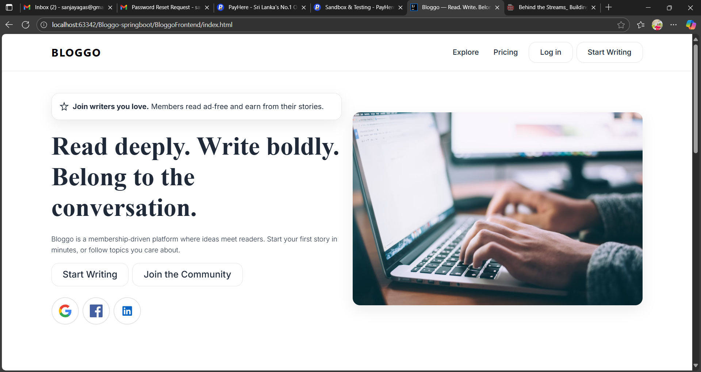

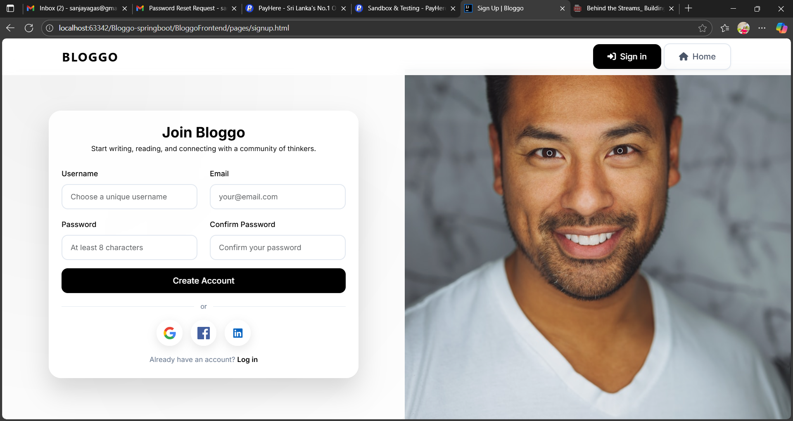
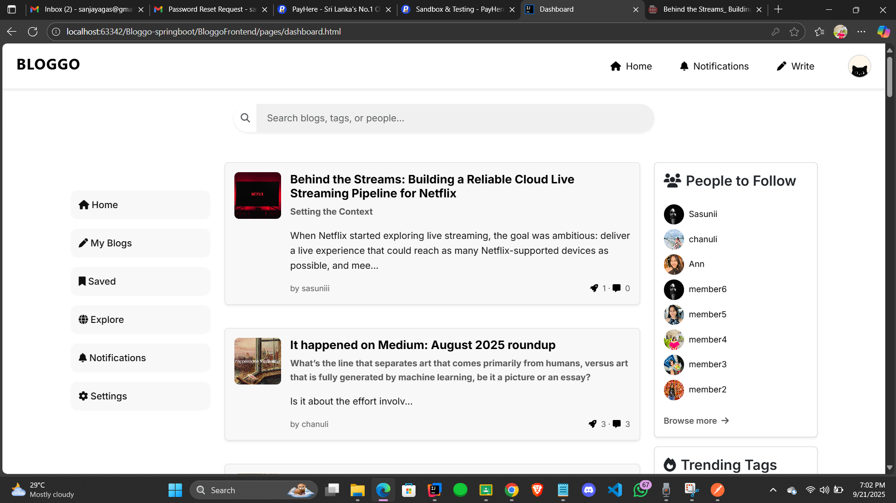
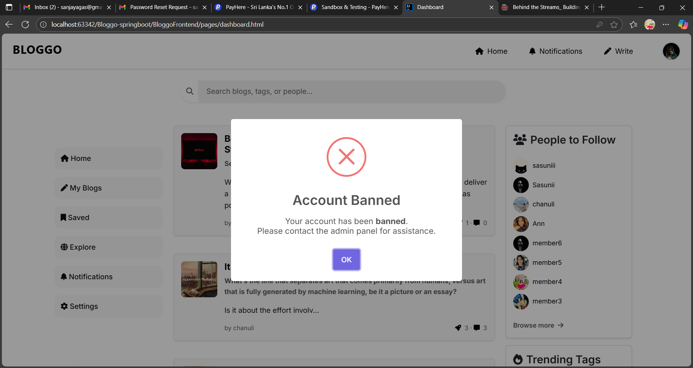
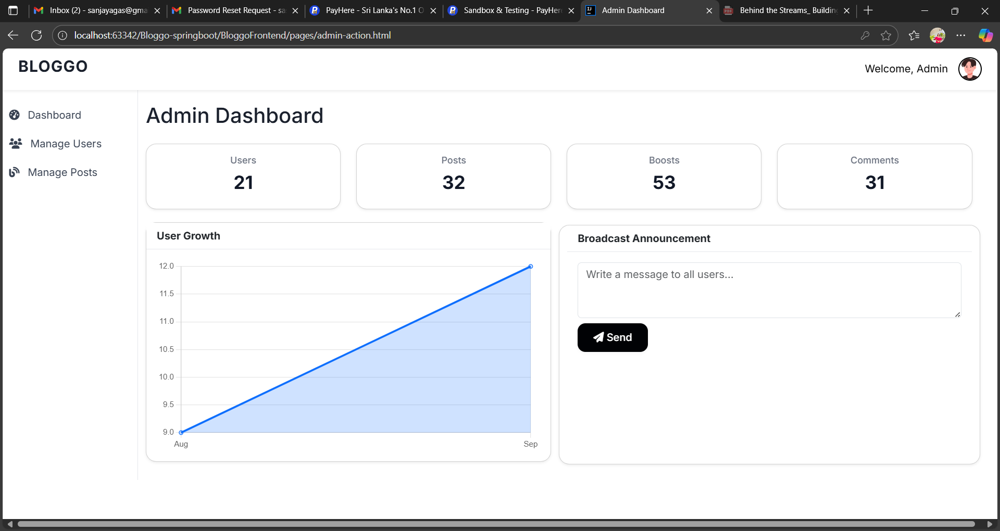

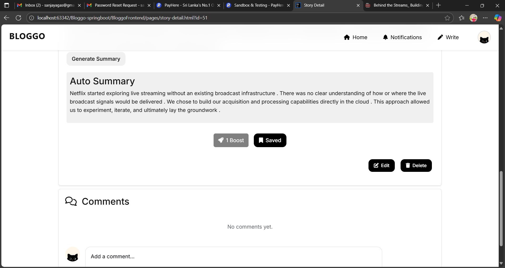
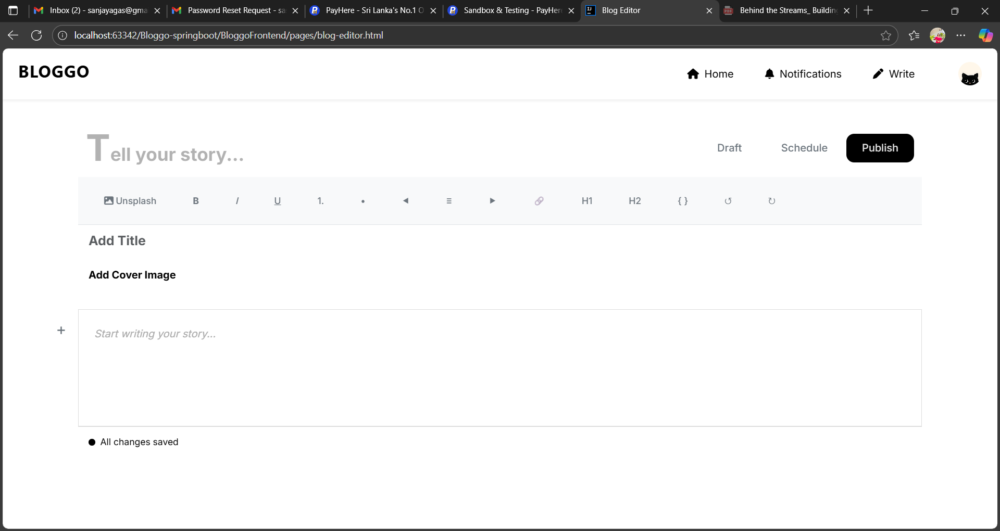
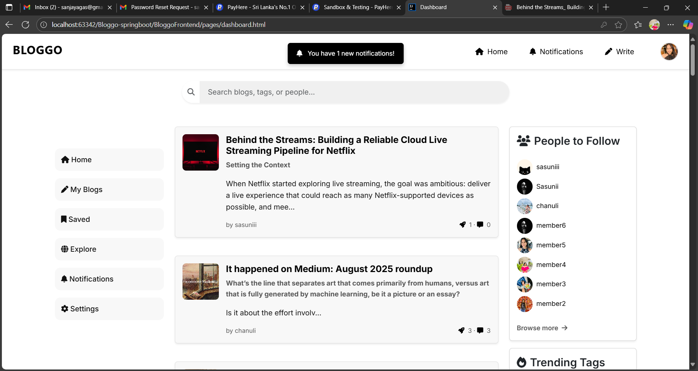
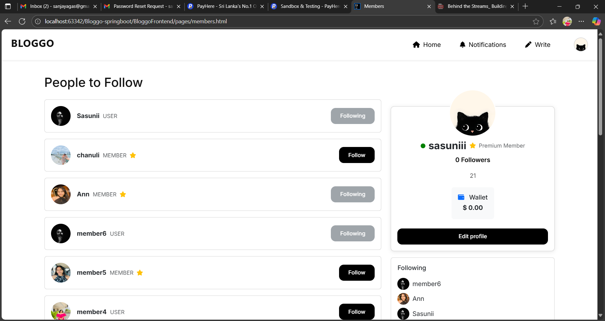

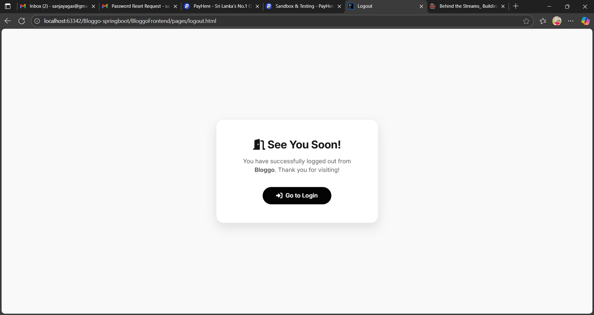
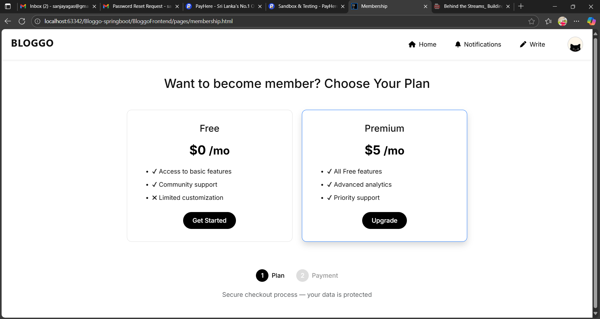
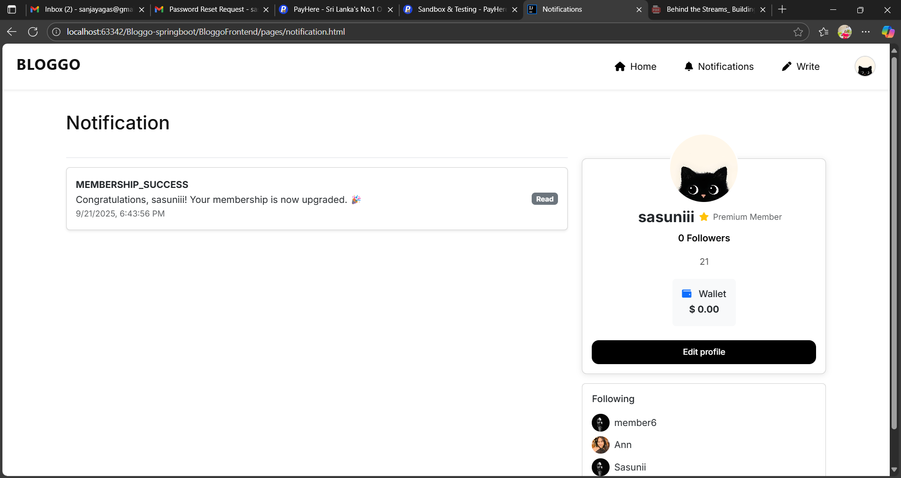
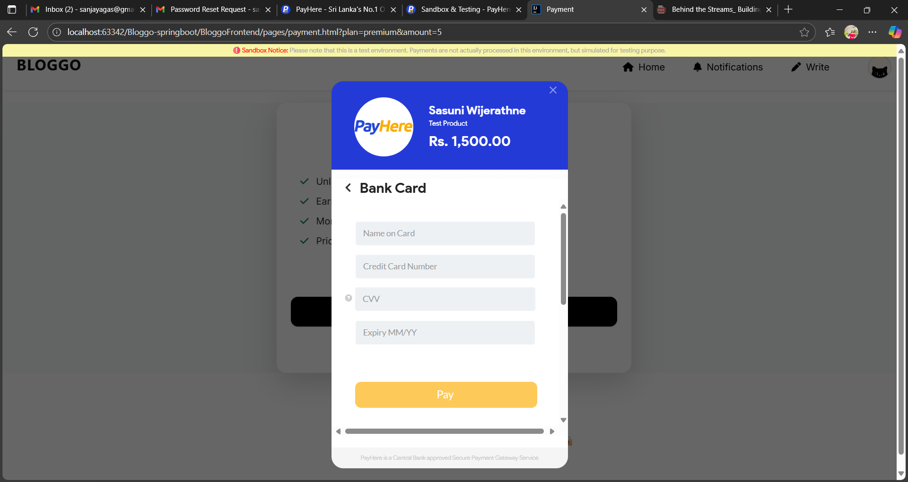
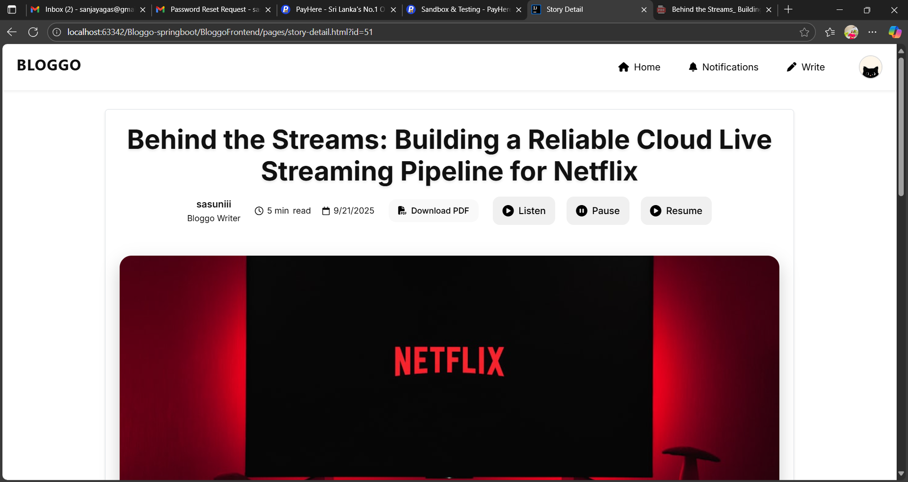


---

## 3. Setup Instructions

### 🔧 Backend (Spring Boot)
1. Clone the repository:
   ```bash
   git clone https://github.com/your-username/bloggo.git
   cd bloggo/backend

2. Configure database connection in application.properties:
    ```bash
    spring.datasource.url=jdbc:mysql://localhost:3306/bloggo
    spring.datasource.username=root
    spring.datasource.password=yourpassword
    spring.jpa.hibernate.ddl-auto=update
    jwt.secret=yourSecretKey

3. Install dependencies and run:
    ```bash
    mvn clean install
    mvn spring-boot:run
   
4. Backend will be available at: http://localhost:8080

## 4. Frontend (HTML, CSS, JS, Bootstrap)

1. Navigate to the frontend directory:
    ```bash
   cd bloggo/frontend
   
2. Open index.html in your browser or serve via a local server (e.g., Live Server in VS Code).

3. Update API endpoints in js/config.js if needed:
    ```bash
   const API_BASE_URL = "http://localhost:8080/api";

## 5. Swagger API Documentation

1. Swagger UI is integrated for exploring and testing APIs interactively. Once the backend is running, open:
   ```bash
   http://localhost:8080/swagger-ui/index.html

This provides access to all endpoints with request/response schemas.

## 5. Demo Video

[Watch Bloggo Demo on YouTube](https://youtu.be/oEVcOOsodZY?si=Lf6PnvCt3wVExucA)


---

## 6. Tech Stack

### 🖥️ Frontend
- **HTML5** – Structure of the web pages
- **CSS3** – Styling and layout
- **JavaScript (ES6)** – Client-side logic and API integration
- **Bootstrap** – Responsive UI components

### ⚙️ Backend
- **Spring Boot** – REST API development
- **Spring Security + JWT + OAuth2** – Authentication & Authorization
- **Spring Data JPA (Hibernate)** – Database interaction
- **WebSockets** – Real-time communication (e.g., active users, notifications)
- **Swagger** – API documentation

### 🗄️ Database
- **MySQL** – Relational database for storing users, posts, and comments

### 🛠️ Tools & Others
- **Maven** – Dependency management
- **Lombok** – Reducing boilerplate code
- **Postman** – API testing
- **Git/GitHub** – Version control  
